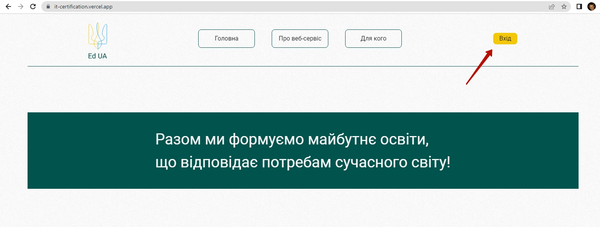
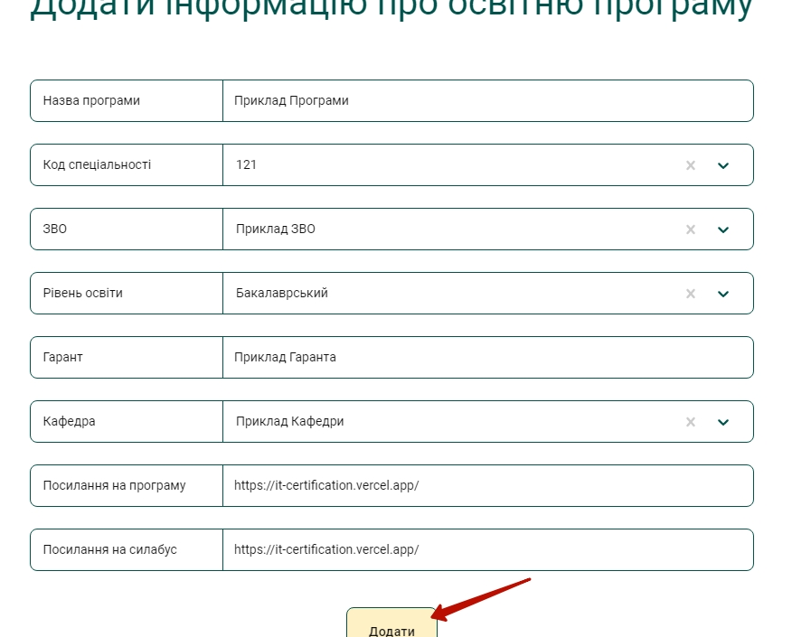

# Інструкція користувача із роллю "Контент-менеджер"
Точка входу:  
https://it-certification.vercel.app/  
**Дія 1. Авторизація**  
Клікаємо по кнопці "Вхід"  
  
Обираємо пункт меню "Логінізація"  
  
Вводимо логін та пароль:  
*Логін:* content1@ited.com  
*Пароль:*  ited_content1  
Та натискаємо кнопку "Увійти"  
  

**Дія 2. Особистий кабінет**  

Якщо логінізація пройшла успішно згори з'являється меню контент-менеджеру.
  

**Пошук інформації**
Наступним кроком для роботи є пошук інформації на сайтах закладів вищої освіти. Якщо ми розглянемо додавання інформації з нуля, то нам необхідно додати:
1. Заклад Вищої освіти
2. Кафедру
3. Освітню програму
4. Викладача
5. Дисципліну

**Дія 3. Додавання Закладу вищої освіти**  
Перейдемо на сторінку "ЗВО" та натиснимо кнопку додавання закладу (+)
  
Введемо всі дані відносно ЗВО: назву, абревіатуру, посилання на сайт та посилання на список освітніх програм ЗВО.

  

Додамо та підтвердимо введення даних.
  

Отримаємо результат
  

**Дія 4. Додавання кафедри**  
Перейдемо на сторінку "Кафедри"та натиснимо кнопку додавання кафдери (+)
  
Внесемо інформацію про кафедру  
  
Та натиснемо кнопку "Додати"
  
Зможемо побачити результат
  

**Дія 5. Додавання освітньої програми**  
Перейдемо на сторінку "Освітні програми" та натиснимо кнопку додавання освітньої програми (+)
  
Введемо всі необхідні дані та натиснемо кнопку "Додати"
  
Отримаємо додану освітню програму
  

**Дія 6. Додавання Дисципліни**  
Перейдемо на сторнку "Дисципліни"  та натиснимо кнопку додавання дисципліни (+)
  
Додамо всі необхідні дані дисципліни та натиснемо кнопку "Додати"
  
Отримаємо додану освітню дисципліну
  

## Підсумки
В результаті роботи - контент-менеджери мають додати приблизно  по 40 дисциплін для 56 освітніх програм, що є Харкові в галузі Інформаційних технологій. Тобто орієнтовно 2240 освітніх дисциплін.

